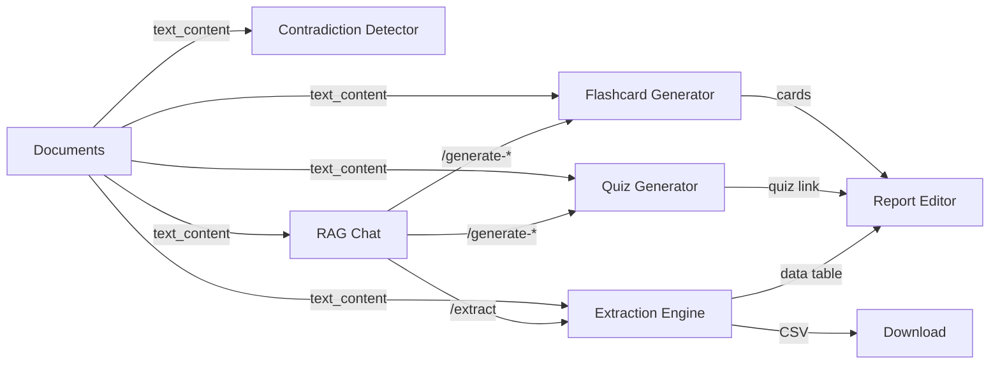

# Feature Integration Enhancement Plan

> **Goal:** Fully integrate Flashcards, Quizzes, Extraction, Contradictions, Matrix, Stats,
> and Retention with the project **Document** pipeline, **Chat**, and **Report** systems so that
> every feature is functional end-to-end rather than a disconnected stub.

> [!IMPORTANT]
> **Phase 0 (CDN → Local Vendor) — COMPLETED ✅**
> All `cdn.jsdelivr.net` references across `base.html`, `base_embed.html`, and `setup.html`
> have been replaced with locally-served vendor files in `static/vendor/`.
> This fixes the browser **Tracking Prevention** that was blocking Bootstrap CSS/JS,
> Bootstrap Icons fonts, and Chart.js — causing zero pages to render correctly.

---

## 1  Current State — Architecture Audit

### 1.1  What Works Today

| Layer | Component | Status |
|-------|-----------|--------|
| **Model** | `Flashcard` (project, document, front/back) | ✅ Schema exists |
| **Model** | `Quiz` / `QuizQuestion` (project, options_json) | ✅ Schema exists |
| **Model** | `ExtractionSchema` / `ExtractionResult` (project, document, data_json) | ✅ Schema exists |
| **Model** | `ResearcherDocument` (text_content, status, RAG sync) | ✅ Fully functional |
| **Route** | `training_bp` — POST generate flashcards/quizzes via LLM | ✅ Backend works |
| **Route** | `extraction_bp` — POST run structured extraction via LLM | ✅ Backend works |
| **Route** | `documents_bp` — upload, list, delete, RAG sync | ✅ Backend works |
| **Route** | `chat_bp` — RAG-powered chat with documents | ✅ Backend works |

### 1.2  What Is Broken or Missing

| Issue | Impact | Severity |
|-------|--------|----------|
| **Flashcards page** — No document selector, no loading indicator, no flip animation | Users can't generate flashcards from specific docs | 🔴 Critical |
| **Quizzes page** — No document selector, quiz generation silently fails, "Take Quiz" UX is a raw stub | Users can't create or take quizzes | 🔴 Critical |
| **Extraction page** — Results are generated but **never displayed** in the UI; no extraction-results table | Extracted data is invisible | 🔴 Critical |
| **Contradictions page** — API route exists but UI is a single input field with no meaningful output rendering | Feature is a stub | 🟡 Medium |
| **Matrix page** — Calls `/projects/{id}/matrices` but body is empty | Feature is a stub | 🟡 Medium |
| **Stats page** — No data sources wired; chart rendering is incomplete | Feature is a stub | 🟡 Medium |
| **Retention page** — Single field, no API feedback | Feature is a stub | 🟡 Medium |
| **Cross-linking** — Flashcards/quizzes/extractions cannot be inserted into the **Report** editor or referenced in **Chat** | No integration | 🟡 Medium |

---

## 2  Blueprint URL Map (Reference)

All API blueprints are registered under `/projects`:

```
training_bp    → /projects/<pid>/flashcards        [GET, POST]
                 /projects/<pid>/quizzes           [GET]
                 /projects/<pid>/quiz              [POST]  ← create
                 /projects/<pid>/quizzes/<qid>     [GET]
extraction_bp  → /projects/<pid>/extraction/schemas [GET, POST]
                 /projects/<pid>/extract           [POST]
                 /projects/<pid>/extractions        [GET]
documents_bp   → /projects/<pid>/documents         [GET]
                 /projects/<pid>/documents/upload   [POST]
                 /projects/<pid>/documents/<did>    [GET, DELETE]
chat_bp        → /projects/<pid>/chat              [POST]
                 /projects/<pid>/chat/history       [GET]
contradiction  → /projects/<pid>/contradictions     [POST]
codes_bp       → /projects/<pid>/codes             [GET, POST, …]
report_bp      → /projects/<pid>/report            [GET, PUT]
```

Dashboard page routes (HTML renderers) live under `/researcher/projects/<pid>/<page>`.

---

## 3  Proposed Changes — Phase-by-Phase

### Phase A: Fix Flashcards & Quizzes (Critical)

#### Phase A.1 — Model Enhancement

##### [MODIFY] [researcher_training.py](file:///c:/Users/f_ald/source/repos/The-Tech-Idea/Beep.AI.Server/Beep.AI.Researcher/app/models/researcher/researcher_training.py)

- Add `difficulty` column to `Flashcard` (`easy | medium | hard`, default `medium`)
- Add `document_id` FK to `Quiz` (currently only on `Flashcard`; a quiz should link to which docs it was generated from)
- Add `QuizAttempt` model to track user quiz scores:

```python
class QuizAttempt(db.Model):
    __tablename__ = 'researcher_quiz_attempts'
    id          = db.Column(db.Integer, primary_key=True)
    quiz_id     = db.Column(db.Integer, db.ForeignKey('researcher_quizzes.id'))
    user_id     = db.Column(db.Integer, db.ForeignKey('users.id'))
    score       = db.Column(db.Integer)  # correct count
    total       = db.Column(db.Integer)
    answers_json = db.Column(db.Text)    # [{"question_id":1,"selected":2,"correct":true}]
    completed_at = db.Column(db.DateTime, default=datetime.utcnow)
```

---

#### Phase A.2 — Backend Route Fixes

##### [MODIFY] [training.py](file:///c:/Users/f_ald/source/repos/The-Tech-Idea/Beep.AI.Server/Beep.AI.Researcher/app/routes/training.py)

- `generate_flashcards`: Accept `document_ids` list (already supported in code!) — just needs frontend wiring
- `generate_quiz`: Same — already accepts `document_ids`
- **NEW** `POST /projects/<pid>/quizzes/<qid>/submit` — Accept answers JSON, score them, persist `QuizAttempt`
- **NEW** `DELETE /projects/<pid>/flashcards/<fid>` — Delete a single flashcard
- **NEW** `DELETE /projects/<pid>/quizzes/<qid>` — Delete a quiz

---

#### Phase A.3 — Flashcards Page Redesign

##### [MODIFY] [flashcards.html](file:///c:/Users/f_ald/source/repos/The-Tech-Idea/Beep.AI.Server/Beep.AI.Researcher/templates/flashcards.html)

**Current:** Empty `#flashcardsList` div, single "Generate" button.

**Redesign to:**
1. **Document selector** — Multi-select checklist of project documents (fetched from `/projects/{pid}/documents`)
2. **Generation options** — Limit slider (5/10/20), difficulty dropdown
3. **Flashcard grid** — Card-flip animation (CSS 3D transforms), front/back, delete button
4. **Study mode** — Fullscreen modal with keyboard navigation (←/→ arrows, Space to flip)
5. **Progress tracker** — Cards studied / total, mastery indicator

##### [MODIFY] [flashcards.js](file:///c:/Users/f_ald/source/repos/The-Tech-Idea/Beep.AI.Server/Beep.AI.Researcher/static/js/flashcards.js)

- Fetch documents list and render checkboxes
- Send selected `document_ids` to POST `/projects/{pid}/flashcards`
- Render flashcards as flip cards with front/back
- Add keyboard navigation and study-mode modal
- Add delete functionality per card

---

#### Phase A.4 — Quizzes Page Redesign

##### [MODIFY] [quizzes.html](file:///c:/Users/f_ald/source/repos/The-Tech-Idea/Beep.AI.Server/Beep.AI.Researcher/templates/quizzes.html)

**Redesign to:**
1. **Document selector** — Same multi-select as flashcards
2. **Generation options** — Quiz name, question count (3/5/10), document scope
3. **Quiz list** — Cards showing quiz name, question count, best score, "Take" button, delete button
4. **Empty state** — Descriptive+actionable (not just text)

##### [MODIFY] [take_quiz.html](file:///c:/Users/f_ald/source/repos/The-Tech-Idea/Beep.AI.Server/Beep.AI.Researcher/templates/take_quiz.html)

**Redesign to:**
1. **Question stepper** — One question at a time with progress bar
2. **MCQ options** — Radio buttons with letter labels (A/B/C/D)
3. **Immediate feedback** — Correct/incorrect highlighting after selection
4. **Results summary** — Score, percentage, review wrong answers
5. **Submit** — POST answers to backend, persist `QuizAttempt`

##### [MODIFY] [quizzes.js](file:///c:/Users/f_ald/source/repos/The-Tech-Idea/Beep.AI.Server/Beep.AI.Researcher/static/js/quizzes.js)

- Full rewrite with document selector, quiz CRUD, score display

##### [MODIFY] [take-quiz.js](file:///c:/Users/f_ald/source/repos/The-Tech-Idea/Beep.AI.Server/Beep.AI.Researcher/static/js/take-quiz.js)

- Full rewrite with question stepper, scoring, submission

---

### Phase B: Fix Extraction (Critical)

#### Phase B.1 — Extraction Page Redesign

##### [MODIFY] [extraction.html](file:///c:/Users/f_ald/source/repos/The-Tech-Idea/Beep.AI.Server/Beep.AI.Researcher/templates/extraction.html)

**Current:** Schema list + create modal, "Run" buttons, but NO results display.

**Redesign to a two-panel layout:**

| Left Panel (Schemas) | Right Panel (Results) |
|---|---|
| Schema list with create/delete | Extraction results table per schema |
| Schema field editor | Row = document, columns = extracted fields |
| Run button per schema | Export to CSV / insert into Report |
| Document selector (which docs to extract from) | Validation status badges |

##### [MODIFY] [extraction.js](file:///c:/Users/f_ald/source/repos/The-Tech-Idea/Beep.AI.Server/Beep.AI.Researcher/static/js/extraction.js)

- Fetch and display extraction results from `GET /projects/{pid}/extractions`
- Render a data table with document rows × schema field columns
- Add "Run on selected documents" with checkboxes
- Add "Export to CSV" client-side
- Add "Insert into Report" that calls the report insertion API

---

### Phase C: Cross-Feature Integration

#### Phase C.1 — Insert into Report

##### [MODIFY] [project-report.js](file:///c:/Users/f_ald/source/repos/The-Tech-Idea/Beep.AI.Server/Beep.AI.Researcher/static/js/project-report.js)

The "Insert Data" modal already has tabs for Codes, Charts, Extractions, Tasks. Wire them:

- **Extractions tab** — Fetch extraction results, allow user to select rows, insert as formatted table into Quill editor
- **Flashcards tab** — (new) Fetch flashcards, insert as Q&A formatted blocks
- **Quizzes tab** — (no direct insert, but link to quiz for readers)

#### Phase C.2 — Chat Integration

##### [MODIFY] [chat.py](file:///c:/Users/f_ald/source/repos/The-Tech-Idea/Beep.AI.Server/Beep.AI.Researcher/app/routes/chat.py)

Expose slash commands from chat that trigger generation:
- `/generate-flashcards` → calls training_bp internally
- `/generate-quiz` → calls training_bp internally
- `/extract <schema-name>` → calls extraction_bp internally

This allows users to generate study materials directly from the chat interface.

##### [MODIFY] [project-search.js](file:///c:/Users/f_ald/source/repos/The-Tech-Idea/Beep.AI.Server/Beep.AI.Researcher/static/js/project-search.js)

- Detect `/generate-flashcards` and `/generate-quiz` commands in user input
- Show inline generation progress and link to results

---

### Phase D: Fix Remaining Stub Pages

#### Phase D.1 — Contradictions

##### [MODIFY] [contradictions.html](file:///c:/Users/f_ald/source/repos/The-Tech-Idea/Beep.AI.Server/Beep.AI.Researcher/templates/contradictions.html)

- Add document selector (which docs to check for contradictions)
- Render results as a comparison table: Claim A vs Claim B, source documents, severity
- Add "Resolve" action that creates a task or note

##### [MODIFY] [contradictions.js](file:///c:/Users/f_ald/source/repos/The-Tech-Idea/Beep.AI.Server/Beep.AI.Researcher/static/js/contradictions.js)

- Wire document selection to `POST /projects/{pid}/contradictions`
- Render structured contradiction results

#### Phase D.2 — Matrix

##### [MODIFY] [matrix.html](file:///c:/Users/f_ald/source/repos/The-Tech-Idea/Beep.AI.Server/Beep.AI.Researcher/templates/matrix.html)

- Render code × document cross-tabulation matrix
- Each cell shows count of coded references
- Click cell to see excerpts

##### [MODIFY] [matrix.js](file:///c:/Users/f_ald/source/repos/The-Tech-Idea/Beep.AI.Server/Beep.AI.Researcher/static/js/matrix.js)

- Fetch codes and documents, build matrix grid
- Handle cell click to show modal with excerpts

#### Phase D.3 — Stats

##### [MODIFY] [stats.html](file:///c:/Users/f_ald/source/repos/The-Tech-Idea/Beep.AI.Server/Beep.AI.Researcher/templates/stats.html)

- Wire data source selection to project documents (CSV/XLSX uploads)
- Render descriptive statistics in formatted tables
- Wire crosstab functionality

#### Phase D.4 — Retention

##### [MODIFY] [retention.html](file:///c:/Users/f_ald/source/repos/The-Tech-Idea/Beep.AI.Server/Beep.AI.Researcher/templates/retention.html)

- Display current retention policy with visual timeline
- Show affected documents count
- Confirm before applying policy changes

---

## 4  Data Flow Diagrams

### 4.1 Document → Feature Generation Flow



### 4.2 Document Selector Component

All features that process documents should share a reusable **Document Selector** component:

```
┌─────────────────────────────────────────┐
│ Select Documents                    [All]│
│ ☑ research_paper.pdf        (4.2 MB)    │
│ ☑ interview_notes.txt       (12 KB)     │
│ ☐ budget_spreadsheet.xlsx   (890 KB)    │
│ ☑ literature_review.md      (45 KB)     │
│                                          │
│ 3 of 4 selected                          │
└─────────────────────────────────────────┘
```

##### [NEW] static/js/components/document-selector.js

Reusable JS module that:
1. Fetches `/projects/{pid}/documents` 
2. Renders checkbox list with file info
3. Exposes `.getSelectedIds()` method
4. Can be instantiated on any page

---

## 5  File Change Summary

### New Files

| File | Purpose |
|------|---------|
| `static/js/components/document-selector.js` | Reusable document multi-selector widget |

### Modified Files — Backend

| File | Changes |
|------|---------|
| `app/models/researcher/researcher_training.py` | Add `QuizAttempt` model, `difficulty` field on Flashcard |
| `app/routes/training.py` | Add quiz submit, flashcard delete, quiz delete endpoints |
| `app/routes/chat.py` | Add slash command detection for `/generate-*` and `/extract` |

### Modified Files — Frontend

| File | Changes |
|------|---------|
| `templates/flashcards.html` | Full redesign: document selector, card grid, study mode |
| `templates/quizzes.html` | Full redesign: document selector, quiz list, scores |
| `templates/take_quiz.html` | Full redesign: question stepper, scoring, submission |
| `templates/extraction.html` | Full redesign: two-panel schema editor + results table |
| `templates/contradictions.html` | Add document selector, structured results display |
| `templates/matrix.html` | Code × document cross-tab grid |
| `templates/stats.html` | Wire to document data sources |
| `templates/retention.html` | Policy timeline, document count |
| `static/js/flashcards.js` | Full rewrite |
| `static/js/quizzes.js` | Full rewrite |
| `static/js/take-quiz.js` | Full rewrite |
| `static/js/extraction.js` | Full rewrite with results display |
| `static/js/contradictions.js` | Wire document selector + results |
| `static/js/matrix.js` | Build matrix grid |
| `static/js/project-report.js` | Wire extraction/flashcard insertion tabs |
| `static/js/project-search.js` | Slash command support |

---

## 6  Implementation Priority

| Priority | Phase | Effort | Impact |
|----------|-------|--------|--------|
| 🔴 P0 | **A** — Flashcards & Quizzes | 2-3 days | Users can generate and study from docs |
| 🔴 P0 | **B** — Extraction results display | 1-2 days | Extracted data becomes visible |
| 🟡 P1 | **C** — Cross-feature integration | 2 days | Report + Chat integration |
| 🟢 P2 | **D** — Stub page completion | 2-3 days | All pages functional |

**Recommended order:** A → B → C → D

---

## 7  Verification Plan

### Automated Testing
- Run existing test suite: `cd Beep.AI.Researcher && python -m pytest tests/ -v`
- Add new tests in `tests/test_training_integration.py`:
  - Test flashcard generation with `document_ids` parameter
  - Test quiz submission and scoring
  - Test flashcard/quiz deletion
- Add new tests in `tests/test_extraction_display.py`:
  - Test extraction results listing endpoint
  - Test extraction results data format

### Manual / Browser Testing
> [!IMPORTANT]
> After each phase, the user should manually test in the browser at `http://localhost:5005`:

1. **Flashcards:** Navigate to project → Flashcards → Select documents → Generate → Verify cards appear with flip animation → Delete a card
2. **Quizzes:** Navigate to project → Quizzes → Select documents → Generate → Take quiz → Verify scoring → Check results
3. **Extraction:** Navigate to project → Extraction → Create schema → Run on selected documents → Verify results table appears → Export CSV
4. **Report integration:** Navigate to project → Report → Click "Insert Data" → Verify Extractions tab shows data → Insert into editor
5. **Chat commands:** Navigate to project → Search & Chat → Type `/generate-flashcards` → Verify flashcards are created

> [!TIP]
> The user should confirm that each feature correctly shows data from their uploaded project documents, not empty stub pages.
